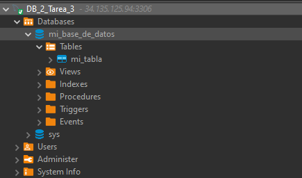
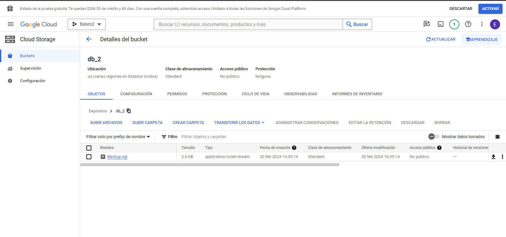

# SISTEMAS DE BASES DE DATOS 2  ( *Tarea 3* ) 

## Creación de BackUp utilizando SQL de google

<p>
En este tutorial, aprenderás cómo hacer un backup de una base de datos MySQL alojada en Google Cloud SQL y cómo enviar ese backup a Google Cloud Storage. 
</p>

## 1. Crear una cuenta de Google Cloud y configurar Google Cloud SDK

1. **Crear una cuenta de Google Cloud**: Si aún no tienes una cuenta de Google Cloud, puedes crear una nueva en [Google Cloud Console](https://console.cloud.google.com/).

2. **Instalar Google Cloud SDK**: Descarga e instala Google Cloud SDK desde [aquí](https://cloud.google.com/sdk/docs/install).

3. **Configurar Google Cloud SDK**: 
<p>

Después de instalar Google Cloud SDK, ejecuta el siguiente comando en tu terminal para iniciar el proceso de configuración:

</p>

   ```bash
   gcloud init
   ```

## Crear una instancia de máquina virtual en Google Cloud Compute Engine
<p>
Utiliza Google Cloud Console o la CLI de Google Cloud SDK para crear una instancia de máquina virtual en Google Cloud Compute Engine. Puedes utilizar el siguiente comando de la CLI como ejemplo:
</p>

```bash
gcloud compute instances create [NOMBRE_INSTANCIA] --zone=[ZONA] --machine-type=[TIPO_DE_MAQUINA]
```

## Realizar un backup de la base de datos MySQL en Google Cloud SQL 


<p align="center">

  

</p>


<p>
Utiliza el cliente de MySQL para conectarte a tu instancia de Cloud SQL y crear un archivo de volcado (backup). Utiliza el siguiente comando en tu terminal:
</p>

```bash
mysqldump -h IP_publica -u usuario -p nombre_base_de_datos > Backup.sql
```

<p align="center">

  

</p>


<p>

Enviar el backup a Google Cloud Storage: Utiliza gsutil para enviar el archivo de backup a Google Cloud Storage. Utiliza el siguiente comando en tu terminal:

</p>

```bash
gsutil cp RUTA_LOCAL_ARCHIVO.sql gs://NOMBRE_BUCKET/
```

<p align="center">

  

</p>

